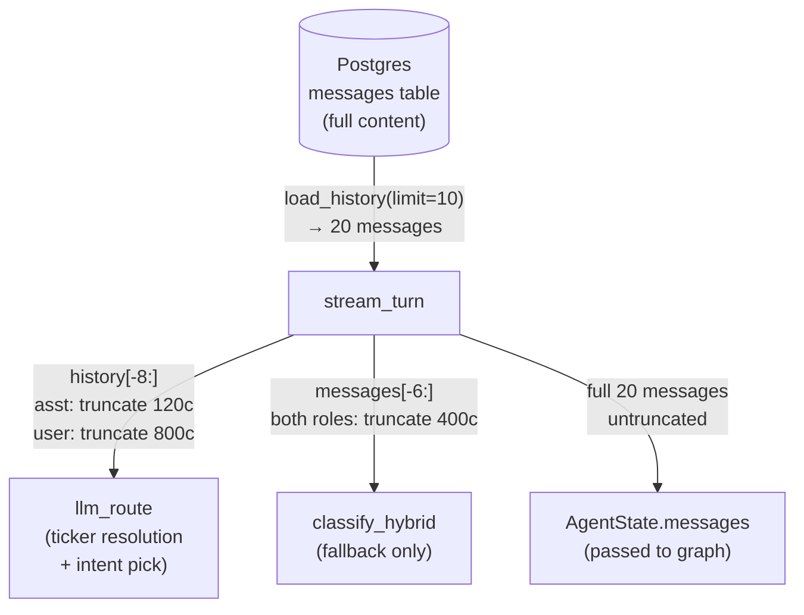
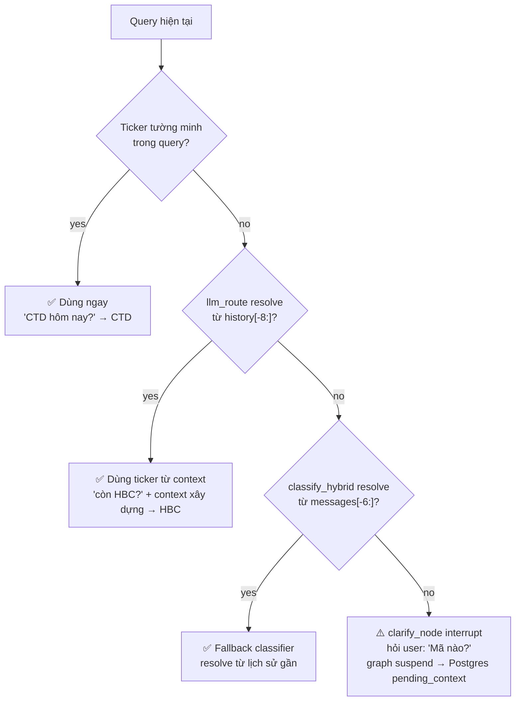
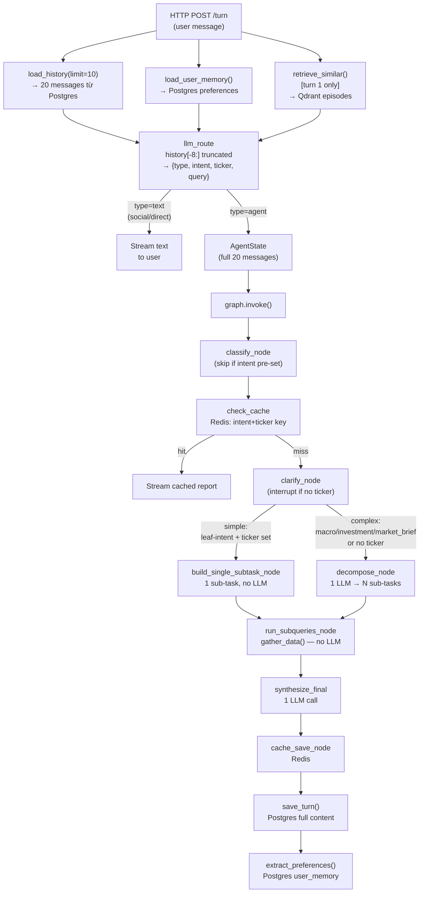

# Conversation Context Flow

Giải thích cách context/memory được truyền qua các turn trong một session, kèm ví dụ cụ thể.

---

## Nơi lưu trữ history

| Layer | Lưu gì | Công nghệ |
|---|---|---|
| Postgres `messages` | Toàn bộ messages (user + assistant, full content) | Postgres |
| Postgres `conversations.pending_context` | PendingContext khi graph bị interrupt (clarify) | Postgres JSONB |
| Qdrant episodic memory | 3 episode tương tự từ các conversation cũ | Qdrant vector |
| Postgres `user_memory` | Preferences người dùng học được từ lịch sử | Postgres |

Không có in-memory store giữa các HTTP request — mỗi turn fetch Postgres từ đầu.

---

## Lượng history mỗi bước nhận được



**Tại sao truncate assistant response xuống 120 chars?**
Report đầy đủ trong history → LLM route sẽ trả lời câu hỏi mới từ data cũ (stale). 120 chars chỉ đủ để biết "đã trả lời topic gì", không đủ để extract số liệu.

---

## Ví dụ: Bank → deeper → specific ticker → switch sang Construction

### Turn 1 — "Tổng quan ngành ngân hàng hôm nay?"

```
history = []   ← session mới, chưa có gì

llm_route:
  history[-8:] = []
  → needs_agent_run(intent="macro_sector", ticker="", query="Tổng quan ngành ngân hàng hôm nay?")

Graph: route_after_clarify → intent=macro_sector, ticker="" → DECOMPOSE path
  decompose_node → LLM tạo sub-tasks:
    [{intent: price_action, tickers: [VCB, TCB, BID], question: "Giá cổ phiếu ngân hàng hôm nay?"},
     {intent: news_sentiment, tickers: [VCB], question: "Tin tức ngành ngân hàng?"},
     {intent: macro_sector, tickers: [], question: "Lãi suất, tỷ giá tác động ngân hàng?"}]
  run_subqueries_node → gather data 3 sub-tasks
  synthesize_final → report ngành ngân hàng

Postgres: lưu (user: "Tổng quan ngành ngân hàng hôm nay?", assistant: "[full report]")
```

---

### Turn 2 — "Còn về dòng tiền khối ngoại thì sao?"

```
history = [
  {role: user,      content: "Tổng quan ngành ngân hàng hôm nay?"},
  {role: assistant, content: "# Vĩ mô & Ngành\n\n**Tỷ giá:..."}   ← full 2000 chars trong Postgres
]

llm_route nhận history[-8:]:
  assistant content bị truncate → "# Vĩ mô & Ngành\n\n**Tỷ giá: USD..." (120 chars)
  
  LLM thấy: user vừa hỏi về ngành ngân hàng → "dòng tiền khối ngoại" = follow-up
  → needs_agent_run(intent="macro_sector", ticker="", query="Dòng tiền khối ngoại vào ngành ngân hàng hôm nay?")
                                                              ↑ LLM tự expand query từ context

Graph: decompose → gather → synthesize
```

---

### Turn 3 — "VCB cụ thể?"  ← ambiguous, implicit ticker từ context

```
history = [turn1_user, turn1_assistant(120c), turn2_user, turn2_assistant(120c)]

llm_route:
  LLM thấy: 2 turn trước đều về ngân hàng, "VCB" xuất hiện trong context
  → needs_agent_run(intent="price_action", ticker="VCB", query="Giá và dòng tiền VCB hôm nay?")
                                            ↑ resolved từ history

Graph: route_after_clarify → intent=price_action, ticker=VCB → FAST PATH (không decompose)
  build_single_subtask_node → [{intent: price_action, tickers: [VCB], question: "..."}]
  run_subqueries_node → price_action.gather_data("VCB", ...)
  synthesize_final → report VCB

LLM call count turn này: 2 (llm_route + synthesize_final), không có decompose
```

---

### Turn 4 — "Kỹ thuật VCB thế nào?"  ← rõ ràng, ticker implicit từ turn trước

```
history = [... turn3_user: "VCB cụ thể?", turn3_assistant(120c): "# Hành động giá VCB..."]

llm_route:
  "VCB" không xuất hiện tường minh nhưng LLM thấy turn trước về VCB
  → needs_agent_run(intent="technical_analysis", ticker="VCB", query="Phân tích kỹ thuật VCB?")

Graph: FAST PATH (technical_analysis + VCB → ticker set)
  1 gather_data call → synthesize
```

---

### Turn 5 — "Chuyển sang xây dựng, CTD hôm nay thế nào?"  ← topic switch

```
history = [turn1..turn4, mỗi assistant bị truncate 120c]

llm_route:
  LLM thấy query có "CTD" và "xây dựng" tường minh → KHÔNG dùng VCB từ context
  Classifier rule: "If the current query explicitly mentions a different ticker, use that context instead"
  → needs_agent_run(intent="price_action", ticker="CTD", query="Giá cổ phiếu CTD hôm nay?")

Graph: FAST PATH (price_action + CTD)
  → CTD data, không liên quan gì đến VCB/ngân hàng
```

---

### Turn 6 — "Còn HBC?"  ← implicit, trong context xây dựng

```
history = [..., turn5_user: "CTD hôm nay", turn5_assistant(120c): "# Hành động giá CTD..."]

llm_route:
  "HBC" là cổ phiếu xây dựng, turn trước về CTD/xây dựng
  → needs_agent_run(intent="price_action", ticker="HBC", query="Giá cổ phiếu HBC hôm nay?")

Graph: FAST PATH (price_action + HBC)
```

---

## Cơ chế resolution ticker — thứ tự ưu tiên



**Context switch không cần reset:** LLM tự detect khi query nhắc ticker/ngành mới,
ưu tiên context hiện tại hơn lịch sử.

---

## Edge case: clarify interrupt (ticker hoàn toàn không rõ)

**User:** "Phân tích kỹ thuật đi" (sau khi nói về nhiều mã khác nhau)

```
llm_route → needs_agent_run(intent="technical_analysis", ticker="", query="...")
                                                          ↑ không resolve được

classify_node → ticker=""
clarify_node:
  detect_ambiguity → ticker missing → interrupt("Bạn muốn phân tích kỹ thuật mã nào?")
  graph suspended, pending_context lưu vào Postgres conversations.pending_context

Turn tiếp theo (user trả lời "VCB"):
  stream_turn detect graph interrupted (prior_state.next != [])
  → Command(resume="VCB")
  → graph tiếp tục từ clarify_node
  merge_with_pending("Phân tích kỹ thuật đi", "VCB") → "Phân tích kỹ thuật VCB"
  re-classify → technical_analysis + VCB → tiếp tục bình thường
```

---

## Episodic memory (Qdrant)

Chỉ chạy ở turn đầu tiên của session:

```python
retrieve_similar(user_id, query, top_k=3)
```

Fetch 3 episode tương tự từ các conversation cũ (vector search). Dùng để build system prompt
với context "user này hay hỏi về gì, sở thích phân tích ra sao". Không ảnh hưởng đến ticker resolution.

---

## Tóm tắt data flow một turn


