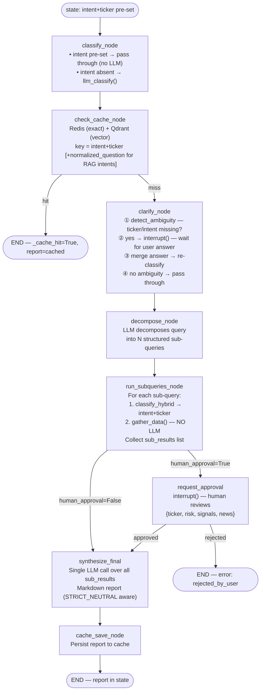

# Agent Graph Flow

## LLM-on-top turn entry (stream_turn)

### Routing decision logic

| LLM action | Meaning | Result |
|---|---|---|
| calls `needs_agent_run` | Financial data needed | `type=agent` → graph |
| calls `direct_reply` | Pure social turn | `type=text` → stream direct |
| no tool call (free text) | LLM chose to answer directly | `type=text` → stream direct |
| exception | LLM failed | `type=agent, market_brief` → graph |

`direct_reply` description is narrow (pure social: greetings, ack, thanks, reactions).
LLM cannot justify calling it for any query referencing a stock, sector, or financial metric.

## Graph internals

## RAG intents (cache key includes normalized_question)

`_RAG_INTENTS = {"rag_qa", "screening", "macro_sector"}`

Different sector queries (banking vs construction) get distinct cache keys because
`normalized_question` is appended to the key — prevents cross-sector contamination.

## gather_data dispatch (run_subqueries_node)

| Intent | gather_data source |
|---|---|
| `price_action` | `intents/price_action.gather_data` |
| `technical_analysis` | `intents/technical.gather_data` |
| `news_sentiment` | `intents/news_sentiment.gather_data` |
| `macro_sector` | `intents/macro_sector.gather_data` |
| `investment_case` | `intents/investment_case.gather_data` |
| `screening` | `intents/screening.gather_data` |
| `rag_qa` | `rag/qa.retrieve_only` |
| `breakout_scan` | `intents/breakout.gather_data` |
| `market_brief` | static placeholder |

## LLM call count per turn

| Path | LLM calls |
|---|---|
| Direct reply (social) | 1 (`llm_route`) |
| Agent path | 1 (`llm_route`) + 1 (clarify detect) + 1 (decompose) + N (classify per sub-query) + 1 (synthesize) = **4+N** |

## Key architecture decisions

| Decision | Reason |
|---|---|
| Two tools (`needs_agent_run` + `direct_reply`) | No free-form escape hatch — LLM makes explicit structured choice. Prevents LLM from answering financial queries from stale history. |
| `tool_choice="auto"` not `"required"` | `required` forces tool call for pure social turns → LLM calls `needs_agent_run` with reconstructed context → wrong. `auto` lets LLM reply freely for social, which we treat as `type=text`. |
| No-tool-call fallback → `type=text` | LLM chose not to call a tool → it's a social/conversational turn. Return its free text. |
| Exception fallback → `type=agent, market_brief` | Safe default: user gets some response. Better than empty. |
| Assistant history truncated to 120 chars in `llm_route` | Full reports in history let LLM answer new ticker queries from stale data. 120 chars = header only (confirms topic, not data). |
| `macro_sector` in `_RAG_INTENTS` | Sector queries need `normalized_question` in key to prevent banking/construction cache cross-contamination. |
| `classify_node` skips LLM when intent pre-set | Avoid redundant classification after `llm_route` already decided. |
