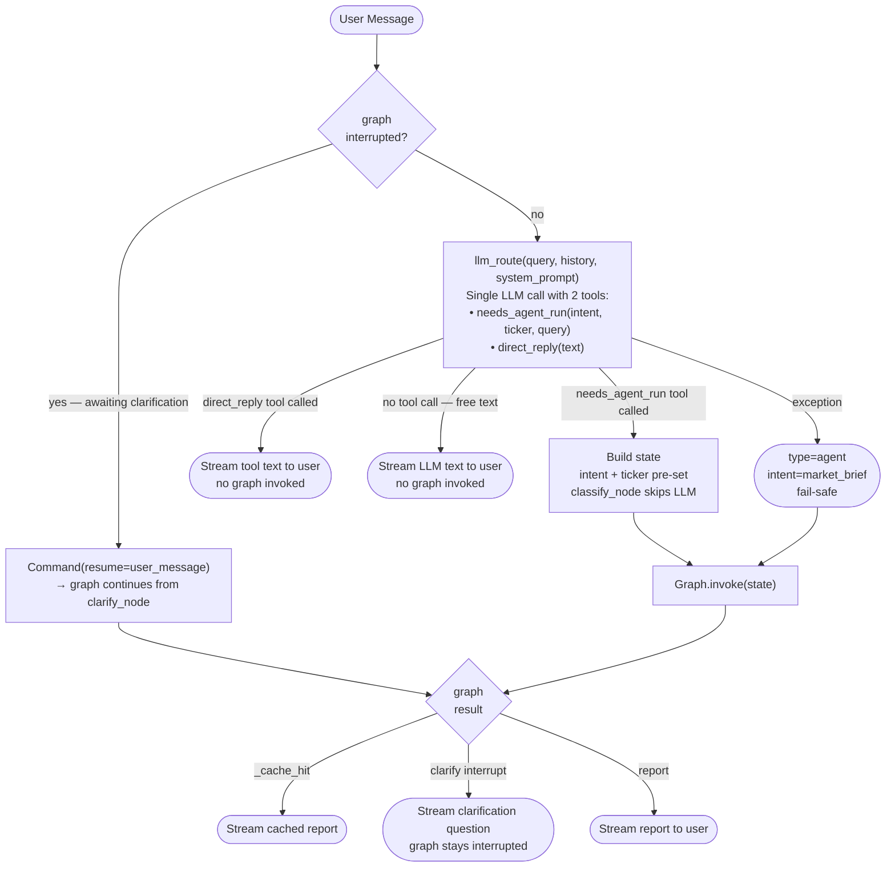
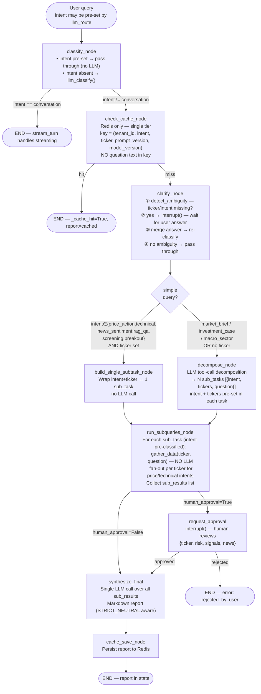

# Agent Graph Flow

## LLM-on-top turn entry (stream_turn)

### Routing decision logic

| LLM action | Meaning | Result |
|---|---|---|
| calls `needs_agent_run` | Financial data needed | `type=agent` → graph |
| calls `direct_reply` | Pure social turn | `type=text` → stream direct |
| no tool call (free text) | LLM chose to answer directly | `type=text` → stream direct |
| exception | LLM failed | `type=agent, market_brief` → graph |

`direct_reply` description is narrow (pure social: greetings, ack, thanks, reactions).
LLM cannot justify calling it for any query referencing a stock, sector, or financial metric.

## Graph internals

## Cache design (single-tier Redis)

Key model: `(tenant_id, intent, ticker, prompt_version, model_version)` — **no question text**.

Same intent+ticker always returns the same cached answer, cross-conversation.

`original_query` is passed to `make_cache_key` only for stable multi-ticker extraction
(e.g. "HPG so với VCB" → `ticker="HPG|VCB"`), not stored in key.

### Per-intent TTL

| Intent | Market hours | Off-hours |
|---|---|---|
| `price_action` | 60 s | 300 s |
| `technical_analysis` | 300 s | 1800 s |
| `news_sentiment` | 600 s | 3600 s |
| `macro_sector` | 600 s | 3600 s |
| `market_brief` | 120 s | 1800 s |
| `investment_case` | 1800 s | 86400 s |
| `rag_qa` | 3600 s | 86400 s |
| `screening` | 300 s | 3600 s |
| `breakout_scan` | 120 s | 3600 s |

Market hours: Mon–Fri 09:00–14:45 VN time (UTC+7).

`conversation` intent → never cached.

## gather_data dispatch (run_subqueries_node)

| Intent | gather_data source |
|---|---|
| `price_action` | `intents/price_action.gather_data` |
| `technical_analysis` | `intents/technical.gather_data` |
| `news_sentiment` | `intents/news_sentiment.gather_data` |
| `macro_sector` | `intents/macro_sector.gather_data` |
| `investment_case` | `intents/investment_case.gather_data` |
| `screening` | `intents/screening.gather_data` |
| `rag_qa` | `rag/qa.retrieve_only` |
| `breakout_scan` | `intents/breakout.gather_data` |
| `market_brief` | static placeholder |

Fan-out applies for `price_action`, `technical_analysis`, `investment_case`, `breakout_scan`:
when a sub-task has multiple tickers, each ticker is fetched independently and results merged.

## LLM call count per turn

| Path | LLM calls |
|---|---|
| Direct reply (social) | 1 (`llm_route`) |
| Simple query (specific ticker, leaf intent) | 1 (`llm_route`) + 1 (`synthesize_final`) = **2** |
| Complex query (no clarify) | 1 (`llm_route`) + 1 (`decompose_node`) + 1 (`synthesize_final`) = **3** |
| Complex query (with clarify) | 1 (`llm_route`) + 1 (clarify re-classify) + 1 (`decompose_node`) + 1 (`synthesize_final`) = **4** |

Simple path: `price_action`, `technical_analysis`, `news_sentiment`, `rag_qa`, `screening`, `breakout_scan` — only when a specific ticker is identified by `llm_route`.

Complex path (always decompose): `market_brief`, `investment_case`, `macro_sector`, or any intent with no ticker.

No per-sub-query classification — intent and tickers are pre-set by `decompose_node` tool calls (complex path) or by `llm_route` directly (simple path).

## Key architecture decisions

| Decision | Reason |
|---|---|
| Two tools (`needs_agent_run` + `direct_reply`) | No free-form escape hatch — LLM makes explicit structured choice. Prevents LLM from answering financial queries from stale history. |
| `tool_choice="auto"` not `"required"` | `required` forces tool call for pure social turns → LLM calls `needs_agent_run` with reconstructed context → wrong. `auto` lets LLM reply freely for social, which we treat as `type=text`. |
| No-tool-call fallback → `type=text` | LLM chose not to call a tool → it's a social/conversational turn. Return its free text. |
| Exception fallback → `type=agent, market_brief` | Safe default: user gets some response. Better than empty. |
| Assistant history truncated to 120 chars in `llm_route` | Full reports in history let LLM answer new ticker queries from stale data. 120 chars = header only (confirms topic, not data). |
| Intent-level cache key (no question text) | Same intent+ticker = same data shape = same answer. Avoids cache misses from paraphrase. `original_query` feeds ticker extraction only. |
| No per-sub-query `classify_hybrid` | `decompose_node` uses tool calling — LLM returns structured `{intent, tickers, question}` directly. Saves N LLM calls per turn. |
| `classify_node` skips LLM when intent pre-set | Avoid redundant classification after `llm_route` already decided. |
| `conversation` intent exits graph immediately | No cache check, no decompose, no gather for pure chat turns. |
| Fast path bypasses `decompose_node` | Single-ticker leaf-intent queries (price_action, technical_analysis, news_sentiment, rag_qa, screening, breakout_scan) skip decompose entirely — saves 1 LLM call + avoids 3 unnecessary data fetches. `macro_sector`, `investment_case`, `market_brief` always decompose (multi-component or no ticker). |
