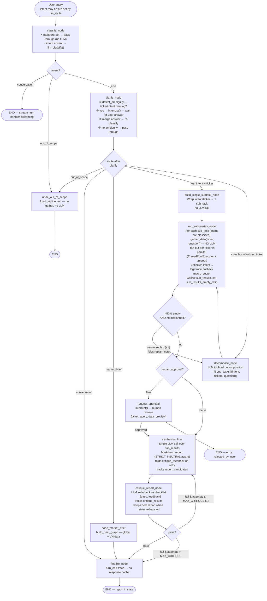

# Agent Graph Flow

## LLM-on-top turn entry (stream_turn)

```mermaid
flowchart TD
    UM([User Message]) --> IT{graph\ninterrupted?}

    IT -->|yes — fresh clarify interrupt| RESUME["Command(resume=user_message)\n→ graph continues from clarify_node"]
    RESUME --> GOUT

    IT -->|yes — stale (>10 min)| ORPHAN["orphan thread_id\n(abandon abandoned clarify)\nroute fresh"]
    ORPHAN --> LLM

    IT -->|no| LLM["llm_route(query, history, system_prompt,\n  focus)\nSingle LLM call with 4 tools:\n• needs_agent_run(intent, ticker, query, reason)\n• direct_reply(text, reason)\n• out_of_scope(text, reason)\n• decompose(segments[{kind,text|intent,ticker,query}])\nfocus = prior turn's Focus (tickers+sector+intent)\ncarry-forward resolved via resolve_focus()"]

    LLM -->|needs_agent_run (valid intent)| PRE["Build state\nintent + ticker + tickers (plural) pre-set\nticker validated vs VN universe\nclassify_node skips LLM"]
    LLM -->|direct_reply| VERIFY{"re-classify\nwith history"}
    VERIFY -->|financial| PRE
    VERIFY -->|social| TEXT([Stream tool text\nno graph invoked])
    LLM -->|out_of_scope| OOS([Stream decline text\ncrypto/foreign/forex — no graph])
    LLM -->|decompose (mixed intent)| MIX["type=mixed, segments=[...]\n_mixed_parts loop:\n• agent seg → graph.invoke\n• general/out_of_scope → drafted text\njoin non-empty parts with blank line"]
    MIX --> GRAPH
    LLM -->|no / invalid tool call| FALLBACK["re-classify\nwith history"]
    FALLBACK -->|agent| PRE
    FALLBACK -->|social / empty| TEXT2([Stream text or short error\nno graph invoked])
    LLM -->|exception| ERR([type=text\nshort Vietnamese error\nno graph])

    PRE --> GRAPH["Graph.invoke(state)"]
    GRAPH --> GOUT{graph\nresult}

    GOUT -->|clarify interrupt| CLARIFY([Stream clarification question\ngraph stays interrupted])
    GOUT -->|report| RPT([Stream report to user])
```

### Routing decision logic

| LLM action | Meaning | Result |
|---|---|---|
| calls `needs_agent_run` (valid intent) | Financial data needed | `type=agent` → graph |
| calls `direct_reply` | Claimed social turn | re-classify w/ history; financial → agent, else text |
| calls `out_of_scope` | crypto / foreign stock / non-VND forex | `type=text` → stream decline, no graph |
| calls `decompose` (≥2 tasks) | Mixed: social + stock, or supported + unsupported | `type=mixed` → `_mixed_parts` runs agent segments through graph, streams drafted text for general/out_of_scope, joins in one reply |
| no / invalid tool call | LLM bypassed tools | re-classify w/ history → agent / text / error |
| exception | LLM failed | `type=text` short error — **never `market_brief`** |

`needs_agent_run` `ticker` is validated against the active VN universe (`core.tickers.get_tickers()`)
before it enters the graph — company names, foreign codes, and market indices drop to `""` and the
graph's clarify/fan-out path re-resolves the subject. The router LLM handles market queries via
`market_brief`/`macro_sector` intent, not via a hardcoded market-index whitelist.

Follow-ups: a `Focus` object (built by `_read_prior` from the checkpointer state of the prior turn) is
passed to the router. `resolve_focus(query, focus)` decides deterministically — new ticker → fresh (no
injection), bare continuation → inherit the whole prior focus (all tickers + intent), otherwise
ambiguous → inject subject only. A message naming a new ticker can never be misread as "inherit old
subject", and a continuation after a comparison keeps every ticker.

Mixed intent: a message carrying ≥2 distinct tasks (social + stock, or a supported analysis +
trade execution) is decomposed by the router into `segments`. `turn_handler._mixed_parts` runs
each `agent` segment through the graph and joins the drafted `general`/`out_of_scope` text into
one reply, so an unsupported sub-request never blocks a supported one (§14.3). The first agent
segment runs on the main thread (focus carry-forward preserved); any extra agent segment runs on
an isolated thread.

## Graph internals



Budget guard: `route_after_subqueries` and `route_after_critique` short-circuit first when the turn
has hit `MAX_TURN_LLM_CALLS` (default 8) or `MAX_TURN_SECONDS` (default 180) — no re-plan/retry once
the budget is gone.

## gather_data dispatch (run_subqueries_node)

| Intent | gather_data source |
|---|---|
| `price_action` | `intents/price_action.gather_data` |
| `technical_analysis` | `intents/technical.gather_data` |
| `news_sentiment` | `intents/news_sentiment.gather_data` |
| `macro_sector` | `intents/macro_sector.gather_data` |
| `investment_case` | `intents/investment_case.gather_data` |
| `screening` | `intents/screening.gather_data` |
| `rag_qa` | `rag/qa.retrieve_only` |
| `valuation` | `intents/fundamentals.gather_data` |
| `breakout_scan` | `intents/breakout.gather_data` |
| `market_brief` | static placeholder |

Fan-out applies for `price_action`, `technical_analysis`, `investment_case`, `breakout_scan`:
when a sub-task has multiple tickers, each is fetched in parallel (`ThreadPoolExecutor`) with a
per-fetch timeout (`GATHER_TIMEOUT_SECONDS`, default 30) and merged in input order.

An unknown intent from `decompose_node` is logged + traced (`gate:gather_unknown_intent`) and falls
back to `macro_sector` instead of silently producing an empty sub-result.

## LLM call count per turn

Base counts (critique passes on first try, no re-plan):

| Path | LLM calls |
|---|---|
| Direct reply (social) | 1 (`llm_route`) |
| Simple query (specific ticker, leaf intent) | 1 (`llm_route`) + 1 (`synthesize_final`) + 1 (`critique_report_node`) = **3** |
| Complex query (no clarify) | 1 (`llm_route`) + 1 (`decompose_node`) + 1 (`synthesize_final`) + 1 (`critique_report_node`) = **4** |
| Complex query (with clarify) | +1 (clarify re-classify) = **5** |

Bounded extra calls (each capped at 1, and blocked once the turn budget is exhausted):

- **Self-critique retry** — `critique_report_node` returns `pass=false` → re-run `synthesize_final` once with `critique_feedback` folded in (`MAX_CRITIQUE=1`).
- **Re-plan** — `run_subqueries_node` reports >50% empty/error sub-results → re-run `decompose_node` once with a `replan_note` (`replan_attempted` guard).

Simple path: `price_action`, `technical_analysis`, `news_sentiment`, `rag_qa`, `valuation`, `screening`, `breakout_scan` — only when a specific ticker is identified by `llm_route`.

Complex path (always decompose): `market_brief`, `investment_case`, `macro_sector`, or any intent with no ticker.

No per-sub-query classification — intent and tickers are pre-set by `decompose_node` tool calls (complex path) or by `llm_route` directly (simple path).

## Agent-style loops (bounded)

Two self-correcting loops added on top of the fixed DAG, both capped so cost stays bounded:

| Loop | Trigger | Action | Cap |
|---|---|---|---|
| **Re-plan** | `sub_results_empty_ratio > 0.5` (gather returned empty/error strings, e.g. ticker miss, tool error) | back to `decompose_node` with a `replan_note` ("thử câu hỏi khác") so different sub-questions are produced | 1 (`replan_attempted`) |
| **Self-critique** | `critique_report_node` flags report missing citation / truncated / off-topic | back to `synthesize_final` with `critique_feedback` folded into the prompt | 1 (`MAX_CRITIQUE`) |

When retries are exhausted, `critique_report_node` keeps the best `report_candidates` entry (a passing
draft if any, else the first draft) so a worse retry never overwrites a better first version.

`_is_empty_result` treats an empty string **and** error stubs (`lỗi:`, `Không có dữ liệu`, `ticker không được rỗng`) as unusable — so an error string no longer counts as "data present".

## Key architecture decisions

| Decision | Reason |
|---|---|
| Four tools (`needs_agent_run` + `direct_reply` + `out_of_scope` + `decompose`) | No free-form escape hatch — LLM makes explicit structured choice. `out_of_scope` gives foreign/crypto/forex a clean decline; `decompose` splits a multi-task message into segments so a supported task runs even alongside an unsupported one. |
| `tool_choice="auto"` not `"required"` | `required` forces tool call for pure social turns → LLM calls `needs_agent_run` with reconstructed context → wrong. `auto` lets LLM reply freely for social, which we treat as `type=text`. |
| No/invalid-tool-call fallback → re-classify with history | The classifier re-resolves intent + ticker with conversation history, so an implicit follow-up still resolves its subject. A social turn returns its free text; a failed classify returns a short error. |
| Exception fallback → `type=text` short error | LLM failure yields a short Vietnamese apology, never a full `market_brief` run (a greeting during a provider outage must not trigger the whole market graph). |
| `needs_agent_run` ticker validated vs VN universe | LLM ticker field can be a company name, "NGANHANG", or a foreign code. Universe-only validation drops those to `""`; the graph re-resolves. No hardcoded market-index whitelist — the router LLM handles market queries via intent. |
| `Focus` object + `resolve_focus` carry-forward rule | Bare follow-ups ("phân tích sâu hơn") need the prior turn's subject; 120-char truncated assistant history can't guarantee it. A deterministic entity check (not marker substrings) decides fresh-vs-carry so a new ticker alongside "phân tích thêm" is never inherited, and a comparison's 2nd/3rd ticker survives the next turn. |
| Assistant history truncated to 120 chars in `llm_route` | Full reports in history let LLM answer new ticker queries from stale data. 120 chars = header only (confirms topic, not data). |
| Stale interrupt orphaned (thread_id swap) | A clarify interrupt left >10 min (user abandoned it) must not swallow every later message. A fresh `thread_id` orphans it and the turn routes normally. |
| No per-sub-query `classify_hybrid` | `decompose_node` uses tool calling — LLM returns structured `{intent, tickers, question}` directly. Saves N LLM calls per turn. |
| `classify_node` skips LLM when intent pre-set | Avoid redundant classification after `llm_route` already decided. |
| `conversation` / `out_of_scope` exit graph immediately | No decompose, no gather for pure chat or declined turns. |
| Fast path bypasses `decompose_node` | Single-ticker leaf-intent queries (price_action, technical_analysis, news_sentiment, rag_qa, valuation, screening, breakout_scan) skip decompose entirely — saves 1 LLM call + avoids 3 unnecessary data fetches. `macro_sector`, `investment_case`, `market_brief` always decompose (multi-component or no ticker). |
| `valuation` split from `rag_qa` | LLM routes metric/peer queries (P/E, P/B, ROE, EPS, EV/EBITDA) to `valuation` → `fundamentals.gather_data` (vnstock/KBS peer table). Report-content queries (revenue, profit, balance sheet) stay `rag_qa` → `retrieve_only` (RAG/SQL). Removes the `_is_sector_comparison` keyword heuristic — routing decision lives in the LLM, not keywords. |
| Re-plan loop capped at 1 | Re-decomposing identical input is usually deterministic; a second decompose rarely adds data. Cap 1 avoids infinite loop while still catching transient tool errors. |
| Self-critique capped at 1 retry | Critiquing the report costs 1 LLM call/turn; 1 retry catches most citation/truncation failures without doubling latency. Best-effort report returned on final fail. |
| Per-turn budget guard | `MAX_TURN_LLM_CALLS` + `MAX_TURN_SECONDS` bound total LLM calls and wall-clock so a pathological turn cannot loop unbounded. |
| Fan-out parallelised with a shared deadline | Multi-ticker fan-out runs in a thread pool under one `GATHER_TIMEOUT_SECONDS` deadline, so N hung sources eat one window, not N×30s serially. |
